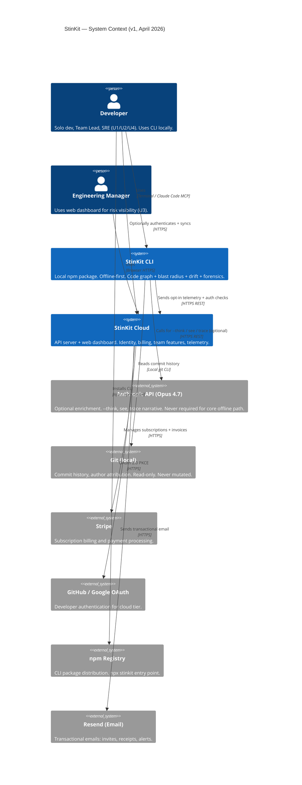
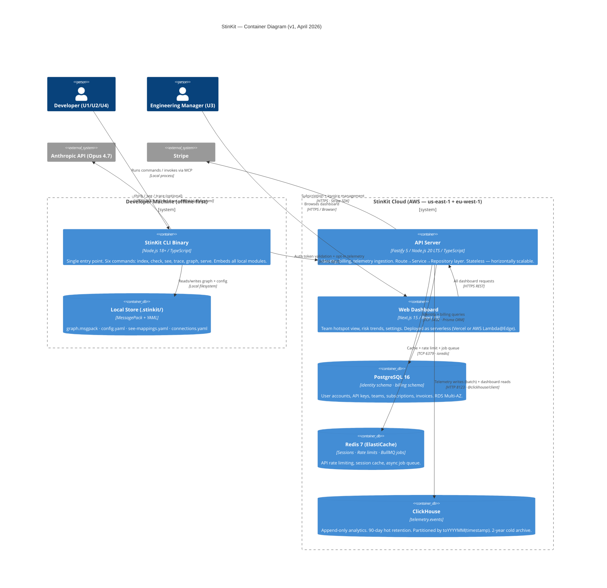
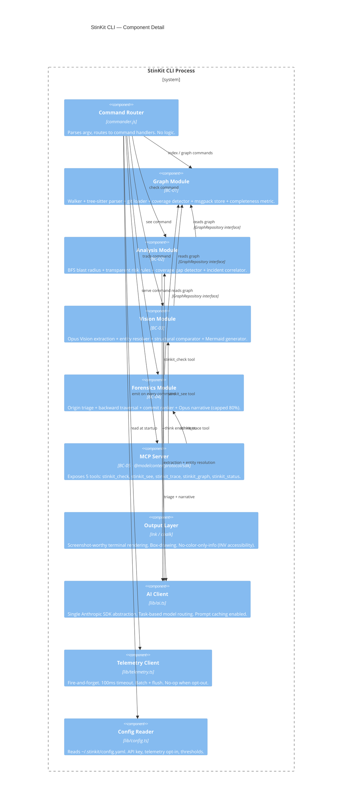

# ARCHITECTURE.md — StinKit
# Mode: ARCHITECT | Agent: TITAN
# Input: docs/EVENT-STORM.md + docs/SPEC.md (CRITIC passed: April 2026)
# Last updated: 2026-04-23
# Owned by: TITAN — no implementation may contradict a DECISION LOCKED without a new ADR.
================================================================================

## Architecture Style Decision

**Style: Hybrid — Modular Monolith (CLI) + Modular Monolith Server (Cloud)**
ADR reference: ADR-001 (monorepo), ADR-002 (CLI modular monolith)

The product has two distinct deployable surfaces with fundamentally different constraints:

| Surface | Style | Reason |
|---|---|---|
| **CLI / Local** | Modular Monolith (single binary) | Offline-first. No network. Developer machine. Zero config. |
| **Cloud API** | Modular Monolith Server | No PMF yet. Microservices require team ≥10 + PMF evidence. |
| **Web Dashboard** | Next.js App Router | Server-side rendering for U3. SEO not needed; SSR for fast TTFB. |

**Microservices trigger:** May split cloud API when ≥ 2 of these are true:
1. Team size ≥ 10 engineers
2. 50K+ MAU with proven retention (D30 ≥ 25%)
3. Independent deploy cadence required by different features
4. Specific service has SLO different from others by > 2 nines

Until then: modular monolith. The module boundaries defined in EVENT-STORM.md are the seams.

================================================================================
## C4 Level 1 — System Context
================================================================================



================================================================================
## C4 Level 2 — Container Diagram
================================================================================



================================================================================
## C4 Level 3 — CLI Component Diagram (key components only)
================================================================================



================================================================================
## Layer Architecture (enforced by fitness-check.sh)
================================================================================

**Rule:** Route → Service → Repository → Database. No layer may skip or reverse.

```
CLI layer (commands/):
  Input parsing (Zod) + user interaction + output rendering
  ↳ Calls: Service interfaces only. Never graph/analysis internals directly.
  ↳ Never: business logic, DB access, AI calls

Service layer (graph/, analysis/, vision/, forensics/):
  Business logic + orchestration within bounded context
  ↳ Calls: Repository interfaces + AI Client (lib/ai.ts)
  ↳ Never: HTTP routes, terminal output, direct DB/filesystem access

Repository layer (graph/persist.ts, graph/store.ts, server/repositories/):
  Data access — filesystem (CLI) or Prisma (server)
  ↳ Calls: filesystem API (CLI), Prisma client (server)
  ↳ Never: business logic, AI calls, external HTTP

Infrastructure layer (lib/):
  Shared utilities: config, errors, AI client, telemetry, cache
  ↳ Used by all layers
  ↳ Never: business logic or presentation
```

**Fitness function (scripts/fitness-check.sh):**
```bash
# No direct DB imports in routes
grep -r "from.*prisma" packages/server/src/routes && exit 1
# No HTTP calls in repositories
grep -r "fetch\|axios\|got" packages/server/src/repositories && exit 1
# No Anthropic SDK outside lib/ai.ts
grep -r "from.*anthropic" packages/cli/src --include="*.ts" \
  | grep -v "lib/ai.ts" && exit 1
# No direct msgpack outside graph/persist.ts
grep -r "msgpack" packages/cli/src --include="*.ts" \
  | grep -v "graph/persist.ts" && exit 1
echo "Fitness check passed."
```

================================================================================
## Repository Structure (Canonical — TITAN-approved)
================================================================================

```
stinkit/                              # monorepo root (pnpm workspaces + Turborepo)
├── CLAUDE.md | CONTEXT.md | ARCHITECTURE.md | SPEC.md etc.
├── docs/
│   ├── EVENT-STORM.md | SPEC.md | ANALYTICS-SCHEMA.md
│   └── adr/
│       ├── 000-template.md
│       ├── 001-monorepo-pnpm.md
│       ├── 002-cli-modular-monolith.md
│       ├── 003-msgpack-graph-persistence.md
│       ├── 004-fastify-cloud-api.md
│       ├── 005-postgres-schema-separation.md
│       ├── 006-clickhouse-telemetry.md
│       └── 007-nextjs-dashboard.md
│
├── packages/
│   ├── shared/                        # shared TypeScript types (zero runtime deps)
│   │   └── src/types/
│   │       ├── graph.ts               # CodeNode, CodeEdge, GraphMeta, GraphCompleteness
│   │       ├── analysis.ts            # BlastRadiusResult, RiskLevel, CoverageGap
│   │       ├── drift.ts               # DriftAnalysis, EntityMatch, DiagramComponent
│   │       ├── forensics.ts           # ForensicsTrace, OriginClass, CommitCandidate
│   │       ├── api.ts                 # REST API request/response shapes
│   │       └── result.ts              # StinKitResult<T> — success | partial | failed
│   │
│   ├── cli/                           # npm package: stinkit
│   │   ├── src/
│   │   │   ├── commands/              # one file per CLI verb (< 150 lines each)
│   │   │   │   ├── index.ts           # commander setup + version + default handler
│   │   │   │   ├── index-cmd.ts       # stinkit index
│   │   │   │   ├── check.ts           # stinkit check
│   │   │   │   ├── see.ts             # stinkit see
│   │   │   │   ├── trace.ts           # stinkit trace
│   │   │   │   ├── graph-cmd.ts       # stinkit graph (reserved name conflict avoided)
│   │   │   │   └── serve.ts           # stinkit serve → MCP server
│   │   │   ├── graph/                 # BC-01: Graph Context
│   │   │   │   ├── index.ts           # GraphRepository interface (port)
│   │   │   │   ├── walker.ts          # recursive fs walk, language detection, gitignore
│   │   │   │   ├── parser.ts          # tree-sitter → CodeNode + call sites
│   │   │   │   ├── git.ts             # git log per node (change_count_6mo, last_changed)
│   │   │   │   ├── coverage.ts        # detect + parse nyc/lcov/coverage.py/go cover
│   │   │   │   ├── store.ts           # in-memory graph (Map<id, CodeNode> + adjacency)
│   │   │   │   ├── persist.ts         # msgpack encode/decode (ONLY msgpack import)
│   │   │   │   └── completeness.ts    # compute static_resolution_rate + blind spots
│   │   │   ├── analysis/              # BC-02: Analysis Context
│   │   │   │   ├── index.ts           # AnalysisService interface (port)
│   │   │   │   ├── blast-radius.ts    # BFS traversal, configurable depth
│   │   │   │   ├── risk.ts            # transparent rule engine (CRITICAL/HIGH/MEDIUM/LOW)
│   │   │   │   ├── coverage-gap.ts    # gap detector using CodeNode coverage signals
│   │   │   │   └── incident.ts        # git note / commit message incident correlation
│   │   │   ├── vision/                # BC-03: Vision/Drift Context
│   │   │   │   ├── index.ts           # VisionService interface (port)
│   │   │   │   ├── extract.ts         # Opus Vision API call + schema validation + retry
│   │   │   │   ├── resolve.ts         # entity resolution via Opus
│   │   │   │   ├── compare.ts         # deterministic structural diff
│   │   │   │   ├── report.ts          # accuracy score + Mermaid generator
│   │   │   │   └── mappings.ts        # see-mappings.yaml read/write
│   │   │   ├── forensics/             # BC-04: Forensics Context
│   │   │   │   ├── index.ts           # ForensicsService interface (port)
│   │   │   │   ├── triage.ts          # Opus origin classification (CODE|INFRA|CONFIG|…)
│   │   │   │   ├── backward.ts        # backward BFS from error nodes
│   │   │   │   ├── ranking.ts         # commit ranking (deterministic — no LLM)
│   │   │   │   └── narrative.ts       # Opus causal chain + cap at 80% confidence
│   │   │   ├── mcp/                   # BC-05: Integration (MCP surface)
│   │   │   │   ├── server.ts          # MCP server factory
│   │   │   │   └── tools/
│   │   │   │       ├── check.ts       # stinkit_check MCP tool
│   │   │   │       ├── see.ts         # stinkit_see MCP tool
│   │   │   │       ├── trace.ts       # stinkit_trace MCP tool
│   │   │   │       ├── graph.ts       # stinkit_graph MCP tool
│   │   │   │       └── status.ts      # stinkit_status MCP tool
│   │   │   ├── output/                # presentation layer (terminal + HTML)
│   │   │   │   ├── renderer.ts        # box-drawing, color+label (WCAG: no color-only)
│   │   │   │   ├── html-report.ts     # static HTML report generator
│   │   │   │   └── themes.ts          # color constants (never inline)
│   │   │   └── lib/                   # cross-cutting infrastructure
│   │   │       ├── ai.ts              # ONLY Anthropic SDK import — task-based model router
│   │   │       ├── config.ts          # ~/.stinkit/config.yaml reader
│   │   │       ├── errors.ts          # StinKitResult<T>, error classes, retry
│   │   │       ├── connections.ts     # .stinkit/connections.yaml reader
│   │   │       └── telemetry.ts       # fire-and-forget TelemetryClient
│   │   └── tests/
│   │       ├── unit/                  # per-module pure function tests
│   │       ├── integration/           # full command e2e (with fixture repos)
│   │       └── fixtures/              # small repos for deterministic tests
│   │
│   ├── server/                        # cloud API (Fastify)
│   │   ├── src/
│   │   │   ├── app.ts                 # Fastify app factory + plugin registration
│   │   │   ├── server.ts              # startup entry point (env validation + listen)
│   │   │   ├── routes/v1/
│   │   │   │   ├── health.ts          # GET /api/v1/health — no auth required
│   │   │   │   ├── auth.ts            # POST register/login/refresh/logout/oauth
│   │   │   │   ├── teams.ts           # CRUD teams + members
│   │   │   │   ├── billing.ts         # subscription + portal + usage
│   │   │   │   └── telemetry.ts       # POST /api/v1/telemetry/events (batch ingest)
│   │   │   ├── services/
│   │   │   │   ├── identity.ts        # user/team business logic
│   │   │   │   ├── billing.ts         # subscription + usage logic
│   │   │   │   └── telemetry.ts       # batch write to ClickHouse
│   │   │   ├── repositories/
│   │   │   │   ├── user.ts
│   │   │   │   ├── team.ts
│   │   │   │   ├── api-key.ts
│   │   │   │   └── subscription.ts
│   │   │   └── lib/
│   │   │       ├── db.ts              # Prisma client (identity + billing schemas)
│   │   │       ├── clickhouse.ts      # @clickhouse/client abstraction
│   │   │       ├── cache.ts           # ioredis wrapper
│   │   │       ├── auth.ts            # JWT sign/verify + bcrypt
│   │   │       ├── stripe.ts          # Stripe SDK abstraction
│   │   │       ├── rate-limit.ts      # per-IP + per-user rate limiter
│   │   │       └── errors.ts          # FastifyError subclasses + error codes
│   │   ├── prisma/
│   │   │   ├── schema.prisma          # identity + billing schemas defined
│   │   │   └── migrations/
│   │   └── tests/
│   │
│   └── web/                           # Next.js 15 dashboard
│       ├── app/
│       │   ├── layout.tsx | page.tsx | not-found.tsx | error.tsx | loading.tsx
│       │   ├── (auth)/                # /login /register /reset-password
│       │   └── (app)/
│       │       ├── layout.tsx         # auth-gated app shell + nav
│       │       ├── dashboard/         # hotspot heatmap + risk trends (U3)
│       │       ├── repos/             # repo list + blast radius detail
│       │       └── settings/          # team management, billing, API keys
│       ├── components/
│       │   ├── ui/                    # shadcn/ui primitives (< 80 lines each)
│       │   ├── features/              # StinKit-specific components (< 120 lines)
│       │   └── charts/                # Recharts wrappers
│       └── lib/
│           ├── api.ts                 # type-safe API client (fetch wrapper)
│           └── auth.ts                # session management
│
├── infrastructure/
│   ├── docker-compose.yml             # dev: postgres + redis + clickhouse
│   ├── modules/                       # Terraform modules (IaC gate)
│   └── environments/ staging/ production/
│
├── scripts/
│   ├── validate-env.ts
│   ├── hygiene-check.ts
│   └── fitness-check.sh
│
├── .github/workflows/apex.yml
├── pnpm-workspace.yaml
├── turbo.json
└── package.json
```

================================================================================
## Database Schema Design
================================================================================

### PostgreSQL (primary — AWS RDS Multi-AZ)

Three schemas, zero cross-schema foreign keys. Services own their schema.

```sql
-- ──────────────────────────────────────────
-- SCHEMA: identity
-- ──────────────────────────────────────────
CREATE SCHEMA identity;

CREATE TABLE identity.users (
  id             UUID PRIMARY KEY DEFAULT gen_random_uuid(),
  email          TEXT UNIQUE NOT NULL,
  password_hash  TEXT,                          -- NULL for OAuth-only accounts
  display_name   TEXT,
  created_at     TIMESTAMPTZ NOT NULL DEFAULT now(),
  deleted_at     TIMESTAMPTZ,                   -- soft delete; hard purge after 30 days
  last_seen_at   TIMESTAMPTZ
) PARTITION BY RANGE (created_at);              -- monthly partitions at 500K MAU

CREATE TABLE identity.users_2026_01 PARTITION OF identity.users
  FOR VALUES FROM ('2026-01-01') TO ('2026-02-01');
-- (future partitions created via migration before period starts)

CREATE TABLE identity.api_keys (
  id           UUID PRIMARY KEY DEFAULT gen_random_uuid(),
  user_id      UUID NOT NULL,                   -- references identity.users.id (no FK — cross-schema safe)
  key_hash     TEXT UNIQUE NOT NULL,            -- bcrypt of the raw key (raw never stored)
  name         TEXT NOT NULL,
  scopes       TEXT[] NOT NULL DEFAULT '{}',
  created_at   TIMESTAMPTZ NOT NULL DEFAULT now(),
  last_used_at TIMESTAMPTZ,
  revoked_at   TIMESTAMPTZ
);
CREATE INDEX idx_api_keys_user_id ON identity.api_keys (user_id);

CREATE TABLE identity.teams (
  id           UUID PRIMARY KEY DEFAULT gen_random_uuid(),
  name         TEXT NOT NULL,
  slug         TEXT UNIQUE NOT NULL,            -- URL-safe identifier
  created_at   TIMESTAMPTZ NOT NULL DEFAULT now()
);

CREATE TABLE identity.team_members (
  team_id   UUID NOT NULL,
  user_id   UUID NOT NULL,
  role      TEXT NOT NULL CHECK (role IN ('admin', 'member', 'viewer')),
  joined_at TIMESTAMPTZ NOT NULL DEFAULT now(),
  PRIMARY KEY (team_id, user_id)
);
CREATE INDEX idx_team_members_user_id ON identity.team_members (user_id);

CREATE TABLE identity.oauth_accounts (
  id          UUID PRIMARY KEY DEFAULT gen_random_uuid(),
  user_id     UUID NOT NULL,
  provider    TEXT NOT NULL CHECK (provider IN ('github', 'google')),
  provider_id TEXT NOT NULL,
  created_at  TIMESTAMPTZ NOT NULL DEFAULT now(),
  UNIQUE (provider, provider_id)
);

-- ──────────────────────────────────────────
-- SCHEMA: billing
-- ──────────────────────────────────────────
CREATE SCHEMA billing;

CREATE TABLE billing.subscriptions (
  id                      UUID PRIMARY KEY DEFAULT gen_random_uuid(),
  owner_id                UUID NOT NULL,        -- user_id or team_id (polymorphic)
  owner_type              TEXT NOT NULL CHECK (owner_type IN ('user', 'team')),
  tier                    TEXT NOT NULL CHECK (tier IN ('free', 'pro', 'team', 'enterprise')),
  status                  TEXT NOT NULL CHECK (status IN ('active', 'trialing', 'past_due', 'cancelled')),
  stripe_subscription_id  TEXT UNIQUE,
  current_period_start    TIMESTAMPTZ NOT NULL,
  current_period_end      TIMESTAMPTZ NOT NULL,
  trial_ends_at           TIMESTAMPTZ,
  cancelled_at            TIMESTAMPTZ,
  created_at              TIMESTAMPTZ NOT NULL DEFAULT now()
) PARTITION BY RANGE (current_period_start);

CREATE TABLE billing.usage_meters (
  id                    UUID PRIMARY KEY DEFAULT gen_random_uuid(),
  owner_id              UUID NOT NULL,
  period_start          DATE NOT NULL,
  period_end            DATE NOT NULL,
  deep_analysis_count   INT NOT NULL DEFAULT 0,
  deep_analysis_limit   INT NOT NULL DEFAULT 100, -- tier-based, set at period start
  UNIQUE (owner_id, period_start)
) PARTITION BY RANGE (period_start);

CREATE TABLE billing.invoices (
  id                  UUID PRIMARY KEY DEFAULT gen_random_uuid(),
  subscription_id     UUID NOT NULL,
  amount_cents        INT NOT NULL,
  currency            TEXT NOT NULL DEFAULT 'usd',
  status              TEXT NOT NULL CHECK (status IN ('draft', 'open', 'paid', 'void', 'uncollectible')),
  stripe_invoice_id   TEXT UNIQUE,
  created_at          TIMESTAMPTZ NOT NULL DEFAULT now(),
  paid_at             TIMESTAMPTZ
) PARTITION BY RANGE (created_at);
```

### ClickHouse (telemetry — append-only analytics)

```sql
CREATE DATABASE telemetry;

CREATE TABLE telemetry.events (
  install_id    String,                          -- random UUID from ~/.stinkit/id
  event_name    LowCardinality(String),
  properties    String,                          -- JSON blob (parsed at query time)
  client_version String,
  timestamp     DateTime64(3, 'UTC')
)
ENGINE = MergeTree()
PARTITION BY toYYYYMM(timestamp)
ORDER BY (event_name, timestamp)
TTL timestamp + INTERVAL 90 DAY TO VOLUME 'cold_storage';   -- 90-day hot, 2yr cold
```

### Redis (cache + queues)

```
Key patterns:
  session:{token_hash}         → user session (TTL: 15 min — access token)
  refresh:{token_hash}         → refresh token (TTL: 7 days)
  rate:{ip}:{endpoint}         → request count (TTL: 1 min sliding window)
  rate:{user_id}:{endpoint}    → per-user rate (TTL: 1 min)
  usage:{owner_id}:{period}    → deep analysis counter (TTL: end of billing period)

BullMQ queues:
  telemetry-flush              → batch write to ClickHouse (every 60s or 500 events)
  email                        → transactional email jobs
  gdpr-purge                   → 30-day delayed delete jobs
```

================================================================================
## Cloud Abstraction Interfaces
================================================================================

Per TITAN protocol (CLOUD AGNOSTIC STRATEGY) — no provider SDK imported outside these files:

```typescript
// packages/cli/src/lib/ai.ts — ONLY Anthropic import in entire CLI package
// packages/server/src/lib/db.ts — ONLY Prisma import in server package
// packages/server/src/lib/cache.ts — ONLY ioredis import in server package
// packages/server/src/lib/clickhouse.ts — ONLY @clickhouse/client import
// packages/server/src/lib/stripe.ts — ONLY stripe import

// AI Task routing (never hardcode model strings in business logic)
type AITask =
  | 'think-blast-radius'         // Opus 4.7 — explain deterministic analysis
  | 'vision-extract-diagram'     // Opus 4.7 — 3.75MP vision extraction
  | 'vision-resolve-entities'    // Opus 4.7 — entity mapping
  | 'forensics-triage'           // Opus 4.7 — origin classification (fast)
  | 'forensics-narrate'          // Opus 4.7 — causal chain narrative
```

Model routing table (locked — review quarterly):
```
think-blast-radius:     claude-opus-4-7   maxTokens: 2048   caching: system prompt
vision-extract-diagram: claude-opus-4-7   maxTokens: 1024   vision: true
vision-resolve-entities: claude-opus-4-7  maxTokens: 512
forensics-triage:       claude-opus-4-7   maxTokens: 256    (fast classification)
forensics-narrate:      claude-opus-4-7   maxTokens: 2048   caching: system prompt
```

================================================================================
## DECISIONS LOCKED
(New ADR required to change any entry. Silent contradiction = protocol violation.)
================================================================================

  DL-001  Pre-commit hook exits 0 regardless of risk level. Never blocks.
          Source: SPEC INV-001. ADR: N/A (invariant, not tradeoff).
          Review trigger: Never. This is a product identity commitment.

  DL-002  Source code content is never sent to any external API.
          Only structural data (node IDs, function names, file paths) may leave the machine.
          Source: SPEC INV-005. ADR: N/A.
          Review trigger: Never unless product changes to code-hosting model.

  DL-003  Confidence in forensics output is capped at 80%.
          Source: SPEC INV-004. Enforced in packages/cli/src/forensics/ranking.ts.
          Review trigger: Never — this is a honesty commitment, not a technical limit.

  DL-004  Monorepo with pnpm workspaces + Turborepo.
          Source: ADR-001. Packages: shared, cli, server, web.
          Review trigger: Team size > 10 AND independent deploy cadence needed.

  DL-005  No microservices until 50K MAU with D30 ≥ 25% AND team ≥ 10.
          Source: ADR-002. Event-STORM TITAN review.
          Review trigger: Both conditions met simultaneously.

  DL-006  CLI is a modular monolith. Module boundaries = EVENT-STORM bounded contexts.
          BUILDER may not import from another BC's internals — only through its index.ts port.
          Source: ADR-002. Enforced by hygiene-check.ts.
          Review trigger: A new bounded context needs to be added.

  DL-007  MessagePack for local graph persistence (.stinkit/graph.msgpack).
          No JSON. No SQLite in v1.
          Source: ADR-003.
          Review trigger: graph.msgpack exceeds 150MB for p99 repo OR startup > 3s.

  DL-008  Fastify 5 + Prisma + PostgreSQL for cloud API.
          Source: ADR-004 + ADR-005.
          Review trigger: Framework reaches EOL or a p0 security vulnerability.

  DL-009  PostgreSQL schema separation: identity, billing, public.
          No cross-schema foreign keys. No direct joins across schemas.
          Source: ADR-005.
          Review trigger: Strong operational case for consolidation (e.g., single service owns both).

  DL-010  ClickHouse for telemetry events. PostgreSQL never used for analytics.
          Source: ADR-006.
          Review trigger: ClickHouse operational complexity > team capacity to maintain.

  DL-011  Telemetry is opt-in. No events emitted without explicit consent.
          TelemetryClient.emit() is a no-op when telemetry: false in config.
          Source: SPEC (privacy requirement). GDPR compliance.
          Review trigger: Never — legal requirement.

  DL-012  LLM enrichment never replaces deterministic output.
          Fast tier result is always produced before --think is invoked.
          Opus explains the analysis; it does not recompute it.
          Source: SPEC INV-003.
          Review trigger: Deterministic analysis is proven wrong and LLM is proven right
                          with statistical significance (requires SCHOLAR post-mortem first).

================================================================================
## ADR Registry
================================================================================

  ADR-001  docs/adr/001-monorepo-pnpm.md                    ACCEPTED
  ADR-002  docs/adr/002-cli-modular-monolith.md              ACCEPTED
  ADR-003  docs/adr/003-msgpack-graph-persistence.md         ACCEPTED
  ADR-004  docs/adr/004-fastify-cloud-api.md                 ACCEPTED
  ADR-005  docs/adr/005-postgres-schema-separation.md        ACCEPTED
  ADR-006  docs/adr/006-clickhouse-telemetry.md              ACCEPTED
  ADR-007  docs/adr/007-nextjs-dashboard.md                  ACCEPTED

================================================================================
## Shared Function Registry
================================================================================
(Populated by BUILDER as implementation proceeds. Prevents duplicate utilities.)

  [To be populated at SCAFFOLD / BUILDER stage]

================================================================================
## ERD — Key Entities
================================================================================

```
identity.users ──< identity.api_keys
identity.users ──< identity.oauth_accounts
identity.users >─< identity.teams  (via identity.team_members with role)

billing.subscriptions (owner_id → identity.users OR identity.teams — no FK)
billing.subscriptions ──< billing.invoices
billing.usage_meters (owner_id → same pattern)

telemetry.events (install_id — no FK to identity; anonymous UUID only)

Local (CLI — not in Postgres):
CodeGraph (in-memory + msgpack) ──{ CodeNode
CodeGraph ──{ CodeEdge (from: CodeNode.id, to: CodeNode.id)
```

================================================================================
# END OF ARCHITECTURE.md
# Gate: ARCHITECT complete.
# Next gate: ADR mode (writing 7 ADRs)
# Then: API-DESIGN → SECURITY → INFRA-DESIGN → SLO-DESIGN
================================================================================
